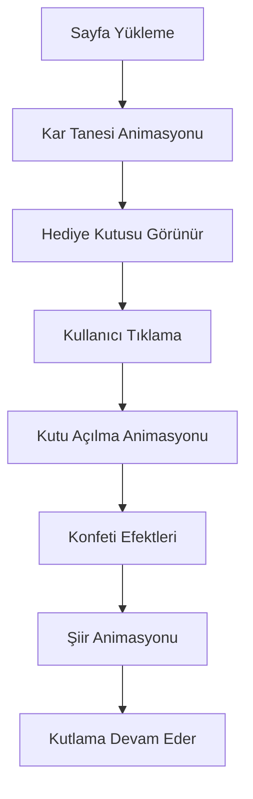

# Berfin Doğum Günü Sürprizi Web Sitesi - Ürün Gereksinimleri Dokümantasyonu

## 1. Ürün Genel Bakış
Berfin için özel tasarlanmış, interaktif doğum günü sürprizi web sitesi. Kar tanesi teması, mavi tonları ve akrostiş şiiri animasyonu ile kişiselleştirilmiş bir deneyim sunuyor.
- Ana amaç: Berfin'e unutulmaz bir doğum günü sürprizi yaşatmak
- Hedef kitle: Berfin ve ona doğum günü kutlaması yapmak isteyen kişiler
- Kar tanesi teması (Berfin = kar tanesi) ve mavi renk paleti ile kişisel bağlantı kurma

## 2. Temel Özellikler

### 2.1 Kullanıcı Rolleri
Bu projede rol ayrımı gerekli değildir - tek sayfalık interaktif deneyim.

### 2.2 Özellik Modülü
Doğum günü sürprizi web sitesi aşağıdaki ana sayfalardan oluşur:
1. **Ana Sayfa**: karşılama animasyonu, hediye kutusu, şiir animasyonu, konfeti efektleri

### 2.3 Sayfa Detayları

| Sayfa Adı | Modül Adı | Özellik Açıklaması |
|-----------|-----------|--------------------|
| Ana Sayfa | Karşılama Animasyonu | Sayfa yüklendiğinde kar tanesi animasyonu ile başlangıç |
| Ana Sayfa | Hediye Kutusu | Tıklanabilir hediye kutusu, açılma animasyonu ile şiiri ortaya çıkarır |
| Ana Sayfa | Akrostiş Şiiri | BERFIN harfleriyle başlayan 6 satırlık şiir, satır satır animasyonla görünür |
| Ana Sayfa | Konfeti Efektleri | Hediye kutusu açıldığında konfeti, kar tanesi ve kutlama efektleri |
| Ana Sayfa | Müzik Kontrolü | Arka plan müziği ile doğum günü melodisi (isteğe bağlı) |
| Ana Sayfa | Responsive Tasarım | Mobil, tablet ve masaüstü uyumlu responsive layout |

## 3. Temel Süreç
Kullanıcı deneyimi akışı:
1. Sayfa yüklenir → Kar tanesi animasyonu başlar
2. Hediye kutusu ekranda belirir → Kullanıcı hediye kutusuna tıklar
3. Kutu açılır → Konfeti efektleri başlar
4. Akrostiş şiiri satır satır animasyonla görünür
5. Kutlama efektleri devam eder

## 4. Kullanıcı Arayüzü Tasarımı
### 4.1 Tasarım Stili
- **Ana renkler**: Mavi tonları (#1E3A8A, #3B82F6, #60A5FA, #93C5FD)
- **İkincil renkler**: Beyaz (#FFFFFF), Gümüş (#E5E7EB)
- **Buton stili**: Yumuşak köşeli, 3D efektli, mavi gradyan
- **Font**: 'Poppins' (modern), 'Dancing Script' (şiir için el yazısı tarzı)
- **Layout**: Merkezi tasarım, card tabanlı
- **İkon stili**: Kar tanesi, hediye kutusu, kalp, yıldız emojileri

### 4.2 Sayfa Tasarım Genel Bakış

| Sayfa Adı | Modül Adı | UI Elementleri |
|-----------|-----------|----------------|
| Ana Sayfa | Karşılama | Mavi gradyan arka plan, kar tanesi animasyonu, "Berfin'e Özel" başlığı |
| Ana Sayfa | Hediye Kutusu | 3D hediye kutusu, mavi kurdele, parlama efektleri, tıklama animasyonu |
| Ana Sayfa | Şiir Bölümü | Şeffaf beyaz kart, el yazısı font, satır satır fade-in animasyonu |
| Ana Sayfa | Efektler | Konfeti parçacıkları, kar tanesi düşme efekti, kalp animasyonları |

### 4.3 Responsive Tasarım
Mobil öncelikli tasarım, dokunmatik etkileşim optimizasyonu ile tablet ve masaüstü uyumlu.
