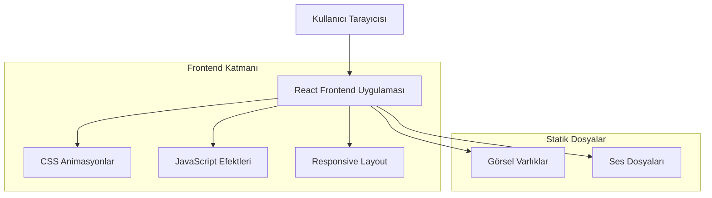

# Berfin Doğum Günü Web Sitesi - Teknik Mimari Dokümantasyonu

## 1. Mimari Tasarım



## 2. Teknoloji Açıklaması

* Frontend: React\@18 + TypeScript + Vite

* Styling: Tailwind CSS\@3 + Framer Motion (animasyonlar için)

* Efektler: Canvas API + CSS3 Animations

* Deployment: Statik hosting (Vercel/Netlify)

## 3. Route Tanımları

| Route | Amaç                                        |
| ----- | ------------------------------------------- |
| /     | Ana sayfa, tüm doğum günü sürprizi deneyimi |

## 4. Bileşen Mimarisi

### 4.1 Ana Bileşenler

```typescript
// Ana bileşen yapısı
interface BirthdayComponents {
  App: React.FC; // Ana uygulama bileşeni
  SnowfallBackground: React.FC; // Kar tanesi arka plan
  GiftBox: React.FC<{onOpen: () => void}>; // Hediye kutusu
  PoemAnimation: React.FC<{isVisible: boolean}>; // Şiir animasyonu
  ConfettiEffect: React.FC<{isActive: boolean}>; // Konfeti efekti
  MusicPlayer: React.FC; // Müzik kontrolü
}
```

### 4.2 Animasyon Sistemi

```typescript
// Animasyon durumları
interface AnimationState {
  snowfallActive: boolean;
  giftBoxOpened: boolean;
  poemVisible: boolean;
  confettiActive: boolean;
  currentPoemLine: number;
}

// Şiir verileri
interface PoemData {
  lines: string[];
  acrostic: string; // "BERFIN"
  timing: number[]; // Her satır için gecikme süreleri
}
```

## 5. Performans Optimizasyonu

### 5.1 Animasyon Performansı

* CSS transforms ve opacity kullanımı (GPU hızlandırması)

* RequestAnimationFrame ile smooth animasyonlar

* Lazy loading için React.Suspense

* Debounced resize handlers

### 5.2 Responsive Stratejisi

* Mobile-first yaklaşım

* CSS Grid ve Flexbox

* Tailwind responsive breakpoints

* Touch-friendly etkileşimler

## 6. Dosya Yapısı

```
src/
├── components/
│   ├── GiftBox.tsx
│   ├── PoemAnimation.tsx
│   ├── SnowfallBackground.tsx
│   ├── ConfettiEffect.tsx
│   └── MusicPlayer.tsx
├── hooks/
│   ├── useAnimationSequence.ts
│   └── useResponsive.ts
├── utils/
│   ├── animationHelpers.ts
│   └── constants.ts
├── assets/
│   ├── images/
│   └── sounds/
├── styles/
│   └── globals.css
└── App.tsx
```

## 7. Animasyon Detayları

### 7.1 Kar Tanesi Sistemi

```typescript
interface Snowflake {
  id: string;
  x: number;
  y: number;
  size: number;
  speed: number;
  opacity: number;
}
```

### 7.2 Hediye Kutusu Animasyonu

* 3D CSS transforms

* Kapak açılma animasyonu (rotateX)

* Parlama efektleri (box-shadow)

* Hover ve click etkileşimleri

### 7.3 Şiir Animasyonu Sırası

1. Hediye kutusu açılır (1s)
2. Konfeti başlar (1.5s)
3. İlk satır görünür (2s)
4. Her satır 0.8s arayla görünür
5. Son satırda özel vurgu efekti

## 8. Browser Uyumluluğu

* Modern browsers (Chrome 90+, Firefox 88+, Safari 14+)

* CSS Grid ve Flexbox desteği

* ES6+ JavaScript özellikleri

* Touch events (mobil cihazlar)

## 9. Deployment Konfigürasyonu

* Build: `npm run build`

* Preview: `npm run preview`

* Statik dosya optimizasyonu

* Gzip compression

* CDN ready assets

